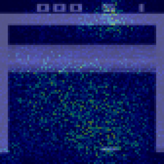

# AtariRL: Deep Q-Network Training Platform

A comprehensive Deep Q-Network (DQN) training system for Atari games with support for all available Atari environments. Train AI agents to master classic Atari games through reinforcement learning, with advanced visualization tools and model analysis capabilities.

## What Makes This Special

- **Multi-Game Mastery**: Train on any Atari game with optimized configurations
- **Advanced DQN Implementation**: State-of-the-art Deep Q-Network with experience replay
- **Rich Visualizations**: Analyze neural network filters, activations, and saliency maps
- **Smart Checkpointing**: Resume training from any point with full state preservation
- **Interactive Gameplay**: Play against trained AI or watch it perform
- **Real-time Monitoring**: TensorBoard integration for training progress tracking

## Quick Overview

This platform enables you to:
- Train DQN agents on classic Atari games like Breakout, Pong, Space Invaders
- Visualize how the neural network learns and makes decisions
- Compare human vs AI gameplay performance
- Export trained models for deployment
- Analyze training progress with detailed metrics

## Table of Contents

- [Features](#features)
- [Quick Start](#quick-start)
  - [1. Install Dependencies](#1-install-dependencies)
  - [2. Run the Training System](#2-run-the-training-system)
  - [3. Test Available Games](#3-test-available-games)
- [Example Usage: Breakout Training](#example-usage-breakout-training)
  - [Training Process](#training-process)
  - [Training Progress](#training-progress)
  - [Model Analysis](#model-analysis)
- [Media Gallery](#media-gallery)
  - [Generated Visualizations](#generated-visualizations)
  - [Video Comparisons](#video-comparisons)
- [Project Structure](#project-structure)
- [Supported Games](#supported-games)
- [Configuration](#configuration)
  - [Game-Specific Settings](#game-specific-settings)
  - [Training Parameters](#training-parameters)
- [Monitoring Training](#monitoring-training)
  - [TensorBoard](#tensorboard)
  - [Console Output](#console-output)
- [Model Management](#model-management)
  - [Checkpoint System](#checkpoint-system)
  - [Resume Training](#resume-training)
- [Usage Examples](#usage-examples)
  - [Training](#training)
  - [Playing](#playing)
  - [Visualization](#visualization)
- [Advanced Usage](#advanced-usage)
  - [Custom Game Configuration](#custom-game-configuration)


## Features

- **Multi-Game Support**: Train on any available Atari game
- **Interactive Game Selection**: User-friendly menu to choose games
- **Game-Specific Configurations**: Optimized parameters for each game
- **Customizable Training**: Adjust learning rate, epsilon, batch size, etc.
- **TensorBoard Integration**: Monitor training progress
- **Model Persistence**: Save and load trained models with resume capability
- **GPU Support**: Automatic CUDA detection and usage

## Quick Start

### 1. Install Dependencies

```bash
# Install all required packages
pip install -r requirements.txt

# Accept Atari ROM licenses (required for Atari games)
AutoROM --accept-license
```

### 2. Run the Training System

```bash
python main.py
```

This will:

1. Show you a menu of available Atari games
2. Let you select a game to train
3. Display game-specific information
4. Allow you to customize training parameters
5. Start training with your chosen configuration

### 3. Test Available Games

```bash
python test_games.py
```

## Example Usage: Breakout Training

Here's a complete example of training the DQN agent on Breakout for 5,000 epochs:

### Training Process

```bash
# Start training on Breakout
python main.py

# Select "Breakout" from the game menu
# Use default parameters or customize:
# - Epochs: 5000
# - Learning Rate: 0.0001
# - Epsilon: 1.0 → 0.1
# - Batch Size: 32
# - Memory Capacity: 100000
```

### Training Progress

The system automatically saves checkpoints every 1,000 epochs:

- `model_Breakout_1000.pt` - After 1,000 epochs
- `model_Breakout_2000.pt` - After 2,000 epochs
- `model_Breakout_3000.pt` - After 3,000 epochs
- `model_Breakout_4000.pt` - After 4,000 epochs
- And so on... 


### Model Analysis

The trained model can be analyzed using various visualization tools:

```bash
# View learned filters from the first convolutional layer
python visualize.py --type filters --checkpoint models/model_Breakout_5000.pt

# Analyze layer activations
python visualize.py --type activations --layer conv1 --checkpoint models/model_Breakout_5000.pt

# Create saliency maps showing what the model focuses on
python visualize.py --type saliency --checkpoint models/model_Breakout_5000.pt

# Export to ONNX for deployment
python visualize.py --type onnx --checkpoint models/model_Breakout_5000.pt
```

## Media Gallery

### Generated Visualizations

The training process generates various visualizations in the `Media/` directory:

#### Neural Network Analysis

**Filter Evolution**  


This GIF stitches together conv1 filters from checkpoints at 1 K, 2 K, … up to your final epoch (5 K here). Watch as the kernels morph from static noise into crisp edge‑ and blob‑detectors.  

**Layer Activations**  
- **Conv1 Activations**  
  
  Given a single Breakout frame, these four feature‑maps show where the first‑layer filters “light up.” Brighter regions mean stronger responses:  
  - Channel 16: a horizontal edge detector focusing on the top brick border and paddle area.  
  - Channel 6: a combination filter firing on long horizontal lines plus small high‑contrast ball blobs.  
  - Channel 27: a vertical‑edge detector sensitive to side walls and ball location.  
  - Channel 11: a region detector that highlights the paddle zone.  
- **Conv2 Activations**  
  
  After two conv layers (16×16 maps), these channels compose simple edges into larger motifs:  
  - Channel 34: walls plus object patterns.  
  - Channel 13: fused horizontal line + blob detection.  
  - Channel 39: an asymmetric wall detector (stronger on right side).  
  - Channel 27: uniform “wall‑and‑ball” pattern.  
- **Conv3 Activations**  
  
  By the third layer (8×8 maps), filters identify whole game‑state elements:  
  - Channel 39: a “brick‑field detector” lighting up all remaining bricks.  
  - Channel 48: a pure top‑row monitor (status of bricks).  
  - Channel 13: a “brick‑and‑ball co‑occurrence” filter.  
  - Channel 31: a “critical play area” focus on paddle/ball only. 

**Saliency Maps**  


This GIF overlays a heatmap onto the preprocessed game frames (upsampled for visibility). Bright regions in the heatmap are the pixels that most influence the agent’s chosen action across the models.  

#### Model Export

- **ONNX Model**: `atari_dqn.onnx` - Exported model for deployment

### Video Comparisons

Watch the AI learn and improve through training:

**Human Player Demo**  


**Model at 1 K Epochs**  


**Model at 5 K Epochs**  


NOTE: 5000 epochs was chosen due to my system. It IS better suited to train the model for a much longer time for better scores. 


## Project Structure

```
proj/
├── main.py              # Main training script with resume capability
├── atari_env.py         # Generic Atari environment wrapper
├── game_selector.py     # Interactive game selection interface
├── agent.py             # DQN agent implementation
├── model.py             # Neural network architecture
├── utils.py             # Utility functions (model loading, etc.)
├── visualize.py         # Consolidated visualization module
├── play.py              # Interactive gameplay (human vs AI)
├── test.py              # Model testing script
├── test_games.py        # Game testing and validation
├── requirements.txt     # Python dependencies
├── .gitignore          # Git ignore rules
├── README.md           # This file
├── models/             # Saved model checkpoints
├── tensorboard_logdir/ # Training logs
├── Media/              # Generated visualizations
│   ├── Breakout_conv1_filters.png
│   ├── filter_evolution.gif
│   ├── saliency_overlay.gif
│   ├── conv1_activations.png
│   ├── conv2_activations.png
│   ├── conv3_activations.png
│   ├── atari_dqn.onnx
│   ├── human.mp4
│   ├── model_1k.mp4
│   └── model_5k.mp4
```

## Supported Games

The system supports all Atari games available in Gymnasium, including:

- Asteroids
- BeamRider
- Boxing
- Breakout
- ChopperCommand
- CrazyClimber
- DemonAttack
- DoubleDunk
- Enduro
- FishingDerby
- Freeway
- Frostbite
- Gopher
- Gravitar
- IceHockey
- Jamesbond
- Kangaroo
- Krull
- KungFuMaster
- MontezumaRevenge
- MsPacman
- NameThisGame
- Phoenix
- Pitfall
- Pong
- PrivateEye
- Qbert
- Riverraid
- RoadRunner
- Robotank
- Seaquest
- Skiing
- Solaris
- SpaceInvaders
- StarGunner
- Tennis
- TimePilot
- Tutankham
- UpNDown
- Venture
- VideoPinball
- WizardOfWor
- YarsRevenge
- Zaxxon

## Configuration

### Game-Specific Settings

Each game has optimized default parameters:

- **Fire First**: Some games require firing to start (e.g., Breakout, SpaceInvaders)
- **No-Op Actions**: Random actions at the start to add variety
- **Action Repeat**: How many times to repeat each action
- **Learning Rate**: Optimized for each game's difficulty

### Training Parameters

You can customize:

- **Epochs**: Number of training episodes
- **Learning Rate**: How fast the model learns
- **Epsilon**: Exploration rate (1.0 → 0.1)
- **Warmup Steps**: Steps before epsilon decay starts
- **Batch Size**: Number of experiences per training step
- **Memory Capacity**: Size of experience replay buffer

## Monitoring Training

### TensorBoard

Training progress is automatically logged to TensorBoard:

```bash
tensorboard --logdir tensorboard_logdir
```

Then open http://localhost:6006 in your browser.

### Console Output

The training shows:

- Episode returns
- Average returns (last 100 episodes)
- Current epsilon value
- Model save progress

## Model Management

### Checkpoint System

Models are automatically saved as checkpoints:

- **Format**: `model_<game_name>_<epoch>.pt`
- **Frequency**: Every 1000 epochs
- **Contents**: Model weights, optimizer state, epoch, epsilon, stats, game config

### Resume Training

The system automatically detects existing checkpoints and offers to resume training:

- Loads all training state (model, optimizer, epoch, epsilon, stats)
- Continues from where it left off
- No loss of progress

## Usage Examples

### Training

```bash
# Start training with game selection
python main.py

# Resume training (automatically finds latest checkpoint)
python main.py
```

### Playing

```bash
# Play games interactively
python play.py

# Test a specific model
python test.py models/model_Breakout_5000.pt
```

### Visualization

```bash
# Plot first layer filters
python visualize.py --type filters --checkpoint models/model_Breakout_5000.pt

# Plot layer activations
python visualize.py --type activations --layer conv1 --checkpoint models/model_Breakout_5000.pt

# Create filter evolution animation
python visualize.py --type animation --game Breakout

# Create saliency overlay (shows what model focuses on)
python visualize.py --type saliency --checkpoint models/model_Breakout_5000.pt

# Export model to ONNX format
python visualize.py --type onnx --checkpoint models/model_Breakout_5000.pt

# Test available games
python test_games.py
```

## Advanced Usage

### Custom Game Configuration

You can modify game configurations in `atari_env.py`:

```python
def get_game_config(game_name):
    # Add your custom configurations here
    game_configs = {
        'YourGame': {
            'fire_first': True,
            'no_ops': 30,
            'learning_rate': 0.00001,
            # ... other parameters
        }
    }
```

